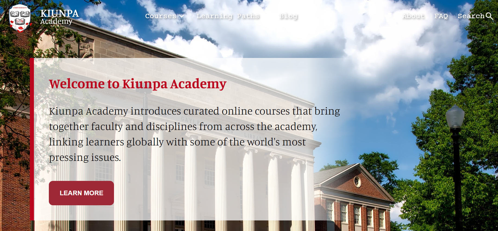

<h1>KIUNPA ACADEMY - informes</h1>
1-17-24 - Inicio del Proyecto. 
1-23-24 - Nuevos sectores añadidos (1-3). 
1-30-24 - Finalizacion del 4to Sector. Demasiadas Complicaciones. 
2-01-24 - Finalizacion de la maquetaciond el proyecto. 
2-03-24 - Implementacion/desarrollo de esquema responsivo. 950px-650px. 
 
<h1>KING'S PANAMA UNIVERSITY - Kiunpa Academy</h1>
<strong>Global Perspective:</strong> 
The academy likely offers courses that address global issues, providing students with a broader perspective on challenges faced by different regions and communities around the world.

 

 

<strong>Online Learning:</strong> 
As mentioned, the courses are offered online, providing flexibility for learners to access educational content from anywhere in the world. This is particularly beneficial for students who may have geographical constraints or other commitments.

 
 

 
 

<strong>Engagement with Pressing Issues:</strong> 
The academy focus on addressing some of the world's most pressing issues. This could involve courses related to environmental sustainability, social justice, healthcare, technology, and more.

 
 

